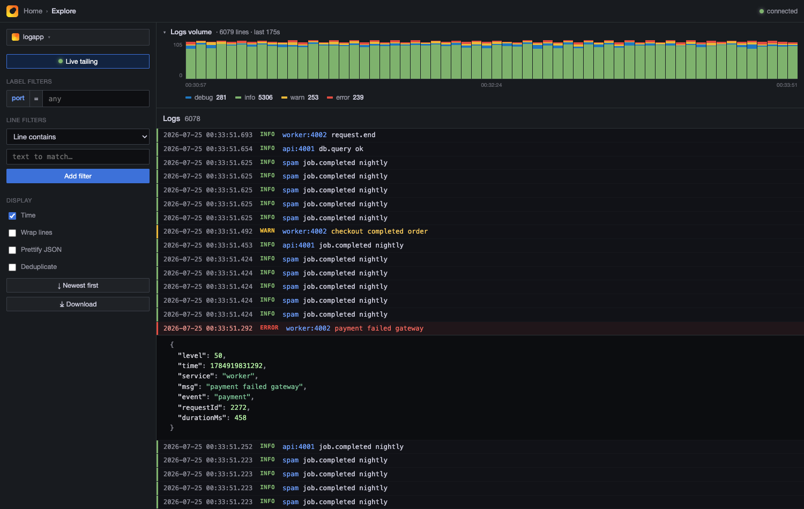

# logapp

A live log viewer with a **Grafana-style browser UI** for any local server.

Pipe any process into `logapp` and watch its logs stream live in Chrome at
`http://localhost:9999` — search, level filters, per-service tabs, JSON expand,
pause, and download. Zero dependencies (pure Node), zero changes to your app.



## Why

Local dev servers print logs to the terminal, where they scroll away and can't be
searched or filtered. `logapp` captures that stdout and gives you a proper log
dashboard in the browser — while still printing to your terminal unchanged.

## Install

```bash
git clone https://github.com/ayush121314/logapp
cd logapp
./install.sh          # adds `logapp` + `--logapp` to your ~/.zshrc
source ~/.zshrc       # or open a new terminal
```

No `npm install` needed — logapp uses only Node's standard library.

## Usage

Three ways, pick whatever fits:

```bash
# 1. Append --logapp to the END of any start command
source env.sh && npm start --logapp

# 2. Explicit pipe (identical to above)
npm start | logapp

# 3. Just open the empty dashboard
logapp
```

Then open **http://localhost:9999** in Chrome. Every command you pipe becomes its
own colour-coded tab, so you can watch several servers side by side:

```bash
cd ecommerce-backend && npm start --logapp     # tab 1
cd ecom-cron-worker  && npm start --logapp     # tab 2
```

Your terminal still shows the original logs — `logapp` only tees a copy to the UI.

### How `--logapp` works

`install.sh` adds a zsh **global alias** to your `~/.zshrc`:

```zsh
alias logapp='node /path/to/logapp/bin/logapp.js'
alias -g -- --logapp='| logapp'
```

Because it's a *global* alias, zsh rewrites `--logapp` anywhere on the line into
`| logapp`, so appending `--logapp` to any command pipes it into the viewer.

The UI is a **Grafana Explore–style** logs view.

> 📖 **Detailed internals:** [`docs/how-it-works.html`](docs/how-it-works.html) — a full section-wise walkthrough of the architecture, data flow, storage model, the `/query` engine, the firehose optimisations, and a complete function/endpoint reference. Open it in a browser.

## Built for the firehose (10k+ lines/sec)

Tested at **10,000 lines/sec**: the daemon stays ~12% of one core and Chrome
stays fully responsive (~0.4ms). How:

- **Raw append** to disk (no re-serialize), amortised in-memory ring.
- **Rate-limited, batched SSE** — the browser gets one batch every 200ms
  (≤ `LOGAPP_LIVE_BATCH`, default 400 lines), not one message per line, so it's
  never flooded. A **`N lines/s` badge** shows the true incoming rate.
- **Capped DOM** (≤ 800 rows) — the browser never renders more than a screenful
  of history regardless of total volume.
- Full history lives on disk; use search / filters / time-range to drill in.

## Features

| Feature | What it does |
| --- | --- |
| Live tail | New lines stream in real time; `Live` toggle + a "N new" pill when scrolled away |
| Logs volume histogram | Stacked bars per time bucket, coloured by level; legend toggles levels |
| Level labels | Each line shows its level (`INFO`/`WARN`/`ERROR`…) in colour; error lines are red |
| Port search | Type a port — logapp auto-detects each server's listening port and filters to it |
| Line filters | Loki-style `Line contains` (`\|=`) / `does not contain` (`!=`) / regex (`\|~` `!~`) |
| Select-to-filter | Select any text in a line **or** in the expanded JSON → popup to add a contains / does-not-contain filter |
| Search | Type to **highlight** matches (line + pretty JSON) live; press Enter / 🔍 to **search the full disk history** (finds matches even beyond the in-memory window) |
| Infinite scroll | Scroll toward older logs and older lines are streamed in from disk on demand (`/query`), so you can browse the whole history without loading it all |
| Time range | Grafana-style picker (Last 5m/10m/15m/30m/1h/3h) + custom From→To; **drag on the histogram** to zoom to a range. All in IST |
| Pretty JSON | On by default — every line auto-expands to a syntax-highlighted, indented JSON view |
| Pretty JSON ↔ Compact | Default expanded, syntax-highlighted JSON; a **Compact table** toggle switches to a real columnar table — sticky header, `Time / Level / App / Message` up front, then **every** JSON field auto-promoted to its own aligned column (ordered by frequency, e.g. `requestId`, `durationMs`, `status`…), with horizontal scroll when there are many. Rows stay single-line and uniform; the full message shows on hover or with **Wrap lines** on. Zebra rows, level colours + search highlight carry over |
| Column chooser | In compact mode a **Columns ▾** dropdown (default **All**) lists every detected field; tick/untick to show or hide any column, or toggle **All columns** at once. Label shows `N/total` when some are hidden. **Your show/hide choice is remembered** across refreshes (localStorage) |
| Resizable columns | Drag any column's right edge in the header to resize it; the width **persists** across refreshes too |
| Copy JSON | Hover any log row → a **copy icon** appears at the right (with a gradient fade so it never clashes with the text); one click copies the row's pretty-printed JSON (raw line for non-JSON logs) to the clipboard, with a "Copied ✓" toast. Works in both views |
| Clickable URLs | Any `http(s)://…` in a message, JSON value, or table cell becomes a **link** — click to open it in a new browser tab (`target=_blank`, `rel=noopener`). URL-encoded `&` etc. are decoded in the target |
| Wrap / Time / Dedup | Wrap long lines, hide timestamps, collapse consecutive duplicates (`×N`) |
| Sort / Download | `Newest first` / `Oldest first`; save the buffer as a `.log` |

## Storage — by repo, 7-day retention (segmented)

Logs are persisted per **repo** (the stream name), not per port:

- `~/Downloads/logapp-logs/<repo>/<YYYY-MM-DD>.jsonl` — one segment file per day
  (`LOGAPP_LOGS_DIR` overrides the root).
- **Append, never delete on kill.** Whatever port the repo runs on, its lines
  append to the same repo folder. The repo's **current port** is auto-detected
  and remembered in `.ports.json`, so a repo that usually runs on `3000` but was
  started on `4050` today is found by either `4050` or its name.
- **7-day retention** (`LOGAPP_RETAIN_DAYS`): old day-segments are simply
  `unlink`ed — no giant-file rewrite, so it scales to huge logs without I/O
  storms (the standard log-segmentation / retention-by-segment pattern used by
  Loki, Elasticsearch ILM, logrotate).
- **Apps dropdown** lists every repo — **live** (green dot, currently streaming)
  and **past** (stopped, still on disk within 7 days). Click to open, then search
  by **app name or port**; selecting an app streams its history back from disk
  (`/query`, reverse-read) and all filters (level, line, search, time) apply to the
  old logs too.
- **Same repo on multiple ports** (e.g. `3000` and `3001` at once) is one app: both
  streams append to the same repo folder (Node serialises each line write, so no
  corruption), it shows every active port (`:3000,3001`), and stays **live** via a
  connection ref-count until the last instance stops.

In memory the daemon keeps a bounded ring (`LOGAPP_BUFFER`, default 20000) and
ships only the last `LOGAPP_SNAPSHOT` (4000) lines to a new tab, so Chrome stays
light even under a firehose; older history comes from disk on demand.

## How it works

- `logapp` runs a tiny local daemon (Node `http`), preferring port `9999`. If
  `9999` is taken by another app it falls back to `9998`, `9997`, … or any free
  port; the client discovers the daemon's actual port via `~/.logapp/daemon.port`
  and opens the browser there. A lock file guarantees a single daemon.
- The daemon is auto-started on the first `--logapp` and opens the browser for you.
- Piped stdout streams to the daemon over one long-lived HTTP request
  (request timeouts disabled, with client auto-reconnect, so long-running servers
  keep streaming for hours).
- The daemon parses each line (pino JSON or plain text), auto-detects the source
  server's listening port (`lsof` over the pipeline's full process tree — works
  even under nodemon/pm2), and pushes over **Server-Sent Events**.
- The UI (`public/index.html`) is a single dependency-free page.

Stop the daemon with `logapp --stop`. Run the backend tests with `npm test`.

## License

MIT
