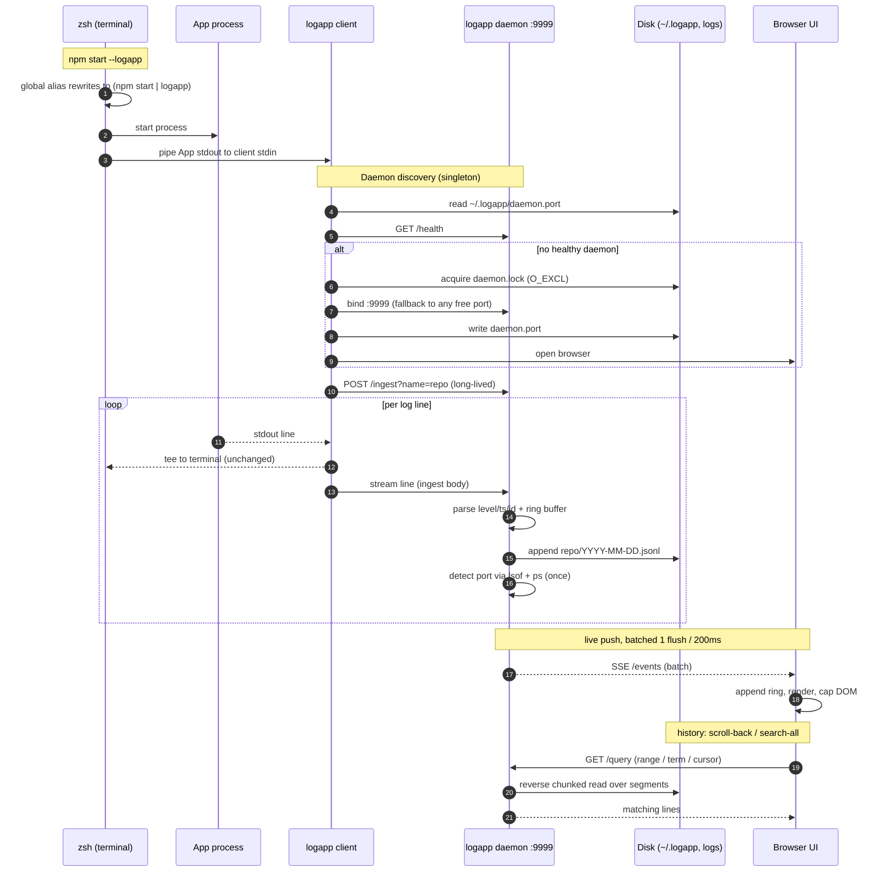

# logapp — How it works

> A zero-dependency, Grafana-Explore-style live log viewer for local servers. Pipe any process into it and watch, search, filter, and browse its logs in the browser — at up to **10,000 lines/second**, without hanging.

`Pure Node stdlib` · `SSE streaming` · `Per-repo disk history` · `7-day retention` · `10k lines/sec` · `Single dependency-free HTML UI`

## Contents

- [What it is](#what-it-is)
- [30-second mental model](#30-second-mental-model)
- **Architecture**
  - [Big picture & data flow](#big-picture--data-flow)
  - [End-to-end sequence](#end-to-end-sequence)
  - [The `--logapp` trick](#the---logapp-trick)
  - [Ports & single daemon](#ports--single-daemon)
  - [Ingest pipeline](#ingest-pipeline)
  - [SSE & batching](#sse--batching)
- **Storage**
  - [Per-repo segments](#per-repo-segments)
  - [7-day retention](#7-day-retention)
  - [Multi-port & concurrent writes](#multi-port--concurrent-writes)
  - [The `/query` engine](#the-query-engine)
- **Frontend**
  - [Grafana-style UI](#grafana-style-ui)
  - [Feature internals](#feature-internals)
  - [Firehose (10k lines/sec)](#firehose-10k-linessec)
- **Reference**
  - [Code structure](#code-structure)
  - [Backend function reference](#backend-function-reference-binlogappjs)
  - [Frontend function reference](#frontend-function-reference-publicindexhtml)
  - [HTTP endpoints](#http-endpoints)
  - [Configuration (environment)](#configuration-environment)
  - [Testing](#testing)

---

## What it is

**logapp** turns any program's stdout into a searchable, filterable, Grafana-like log dashboard in your browser — with **no code changes** to your app and **no dependencies** (only Node's standard library + the browser).

You run your server the way you always do, and append `--logapp` (or pipe `| logapp`). logapp captures the stdout, streams it live to a browser tab, writes it to disk per repo, and lets you search / filter / time-range / scroll back through the full history.

```
# the whole thing is two files + a tiny CLI
logapp/
├─ bin/logapp.js      // ~600 lines — CLI + daemon (HTTP + SSE + storage)
├─ public/index.html  // ~760 lines — the entire single-page UI
├─ test/e2e.js        // dependency-free backend E2E (npm test)
└─ install.sh         // wires the zsh `--logapp` alias
```

## 30-second mental model

1. **CLI mode** — `<cmd> --logapp` becomes `<cmd> | logapp`. The `logapp` process reads stdin, echoes it back to your terminal, and forwards each line to a local **daemon** over one long-lived HTTP request.
2. **Daemon** — a tiny Node HTTP server (prefers port `9999`). It parses each line, keeps a small in-RAM ring, writes the raw line to a per-repo file on disk, and pushes batched updates to browsers over **Server-Sent Events**.
3. **Browser** — one dependency-free HTML page renders a Grafana-Explore-style view: histogram, live tail, filters, search, time range, and an Apps dropdown. Old logs beyond the live window are fetched from disk on demand via `/query`.

## Big picture & data flow

```
  your server (any language)          logapp CLI (pipe client)                 logapp daemon (one per machine)
  ┌───────────────────────┐          ┌──────────────────────────┐             ┌──────────────────────────────────────┐
  │ npm start / nodemon…  │  stdout  │ read stdin  ─┬─► terminal │  HTTP POST  │ /ingest  ── parseLine() ──► ring(RAM)  │
  │ prints logs to stdout │ ───────► │  (tee)       └─► forward  │ ──────────► │            │                          │
  └───────────────────────┘          └──────────────────────────┘  (1 long    │            ├─► disk  ~/Downloads/logapp- │
                                                                      request)  │            │    logs/<repo>/<day>.jsonl   │
                                                                                │            └─► pending[] (batched)        │
                                                                                │                    │ every 200ms          │
                                                                                │  GET /events (SSE)  ◄── broadcast() ──┘   │
                                                                                │  GET /query  ── reverse-read segments     │
                                                                                └──────────────────────────────────────┘
                                                                                             ▲   │ snapshot + live batches
                                                                                             │   ▼
                                                                                ┌──────────────────────────────────────┐
                                                                                │  Browser (public/index.html)         │
                                                                                │  histogram · live tail · filters ·   │
                                                                                │  search · time-range · Apps dropdown │
                                                                                └──────────────────────────────────────┘
```

Three processes, one direction of flow. The **daemon is the hub**: it owns the port, the RAM ring, the disk files, and every browser connection. The CLI client is stateless (just a tee + forwarder). The browser is a pure view that pulls history on demand.

## End-to-end sequence

The same story as a message-by-message sequence — from typing `--logapp` to a line appearing in the browser, plus history reads. Notice **three distinct channels**: the **stdin pipe** (app → client, carries the log data, needs no port), `/ingest` (client → daemon, one long-lived request), and `/events` + `/query` (daemon → browser, live push + history pull). The app's own port is never connected to — only *detected* for labels.



## The `--logapp` trick

How does appending `--logapp` to the *end* of a command turn it into a pipe? A **zsh global alias**. `install.sh` adds two lines to `~/.zshrc`:

```zsh
alias logapp='node "/…/logapp/bin/logapp.js"'
alias -g -- --logapp='| logapp'   # global alias: expands anywhere on the line
```

A normal alias only expands in command position; a **global** alias (`alias -g`) expands *anywhere*. So `npm start --logapp` is rewritten by zsh into `npm start | logapp` before execution.

> ⚠️ Global aliases are loaded when a shell starts. A terminal opened *before* install won't have it — open a new terminal or `source ~/.zshrc`. In pipeline form `source env.sh && npm start --logapp`, the pipe binds to `npm start` (correct), because `&&` separates pipelines.

### `main()` — CLI modes

| Invocation | Mode | What happens |
| --- | --- | --- |
| `<cmd> \| logapp [name]` | pipe | reads stdin, tees to terminal, forwards to daemon (`pipeToDaemon`) |
| `logapp -- <cmd>` | wrapper | spawns the command, captures stdout+stderr, forwards |
| `logapp` | UI | just ensures the daemon is up and opens the browser |
| `logapp --daemon` | daemon | internal — the background HTTP server (spawned automatically) |
| `logapp --stop` | stop | kills the daemon (reads `~/.logapp/daemon.pid`) and clears lock/port files |

The **repo name** is the stream key: an explicit arg (`| logapp myapp`) or, by default, the current folder's basename (`streamNameFromArgs`). Same folder ⇒ same name ⇒ same disk file.

## Ports & single daemon

You only ever open **one** URL — `localhost:9999`. Internally logapp guarantees exactly one daemon and finds a free port if 9999 is taken.

**Discovery (`discoverDaemon`)**

1. Is `9999` a healthy logapp daemon? (`healthCheck` verifies the body contains `"ok":true`, not just a 200 — so a foreign app on 9999 isn't mistaken for ours.) → use it.
2. Else read `~/.logapp/daemon.port` and health-check that. → use it.
3. Else `spawnDaemon` (detached), poll the port file until healthy, then open the browser.

**Binding & the single-daemon lock**

A new daemon takes an exclusive lock (`daemon.lock` via `O_EXCL`) before binding — this defeats the race where two `--logapp` commands start simultaneously and both try to spawn a daemon. Then `chooseAndListen` tries `9999 → 9998 → … → 9990 → 0` (OS-assigned free port); for each candidate it first checks whether a logapp daemon already answers there (reuse & exit) before trying to bind. The chosen port is written to `daemon.port`; the client reads it and opens the right URL — and auto-opens the browser only when it freshly spawned the daemon.

> **State files** live in `~/.logapp/`: `daemon.pid`, `daemon.port`, `daemon.lock`, `daemon.log`. Log data lives separately in `~/Downloads/logapp-logs/`.

## Ingest pipeline

Every incoming line runs through `parseLine` → `ingestEvent` on the daemon:

**`parseLine(line)` — universal, not pino-only**

- If the line looks like JSON (`{…}`): parse it, take `level` (`normalizeLevel` maps pino numerics 10–60 and string levels), `time`, `msg`/`message`/`event`, and keep the whole object as `fields` (for the pretty-JSON view).
- Otherwise (plain text — console.log, python, nginx, docker…): `guessLevel` infers `error/warn/debug/info` from keywords, `ts = now`, `msg =` the raw line, `fields = null`.
- Returns `{stream, level, ts, msg, raw, fields}`. `raw` is the original line (what gets written to disk).

**`ingestEvent(ev)`**

```js
s.count++; s.rateCount++;              // per-stream counters (rate = lines/sec)
buffer.push(ev)                        // in-RAM ring…
if (buffer.length > MAX_BUFFER*1.3)    // …trimmed in bulk (amortised O(1), no per-line splice)
  buffer.splice(0, buffer.length-MAX_BUFFER)
writeToFile(ev)                        // append ev.raw to today's segment file
pending.push(ev)                       // queued for the next SSE batch
```

## SSE & batching

The browser subscribes to `GET /events` (Server-Sent Events). On connect it gets one **snapshot** (the last `LOGAPP_SNAPSHOT` = 4000 lines + all known streams), then live updates. To survive a firehose, live updates are **rate-limited and batched**:

```js
// flush every 200ms — one array message, not one per line
setInterval(() => {
  const batch = pending.slice(-LIVE_BATCH)   // keep the most recent ≤400
  pending.length = 0
  broadcast({ type: 'logs', events: batch, dropped })
}, 200)
```

10,000 lines/sec ⇒ **5 messages/sec** to the browser (not 10,000). A separate 1s timer broadcasts `{type:'rates'}` → the **N lines/s** badge.

| SSE message | Meaning |
| --- | --- |
| `snapshot` | on connect — `{streams, events}` (events capped to SNAPSHOT_LIMIT) |
| `logs` | a live batch of events (every 200ms) |
| `stream` | a stream appeared/changed (port detected, went live/past) |
| `rates` | per-stream lines/sec (every 1s) |

## Per-repo segments

Logs are persisted **per repo**, split into **daily segment files** — the standard log-segmentation pattern (as used by Loki, Elasticsearch ILM, logrotate):

```
~/Downloads/logapp-logs/
├─ .ports.json                 // { "<repo>": ["3000","3001"], … }  repo → ports seen
├─ ecommerce-backend/
│  ├─ 2026-07-25.jsonl         // one file per day (IST date), append-only, raw lines
│  └─ 2026-07-26.jsonl
└─ ecom-cron-worker/
   └─ 2026-07-26.jsonl
```

- **Append, never truncate** (`flags:'a'`). Re-running the repo appends to the same folder — regardless of port.
- **Not deleted on kill, not wiped on start.** The file's lifetime is the retention window, not the process.
- **Raw lines** are written verbatim (no re-serialisation) → cheap, greppable, and re-parseable.
- A backpressure guard skips the disk write if the OS buffer is > 8 MB behind, so a slow disk never blows up RAM.

## 7-day retention

Old data is dropped by **deleting whole day-segments** — an `unlink`, not a rewrite. `pruneIdle` runs on start and every 6 hours:

```js
const cutoff = dayOf(Date.now() - RETAIN_MS)   // e.g. "2026-07-19"
for (repo of listRepos())
  for (day of listSegs(repo))
    if (day < cutoff) fs.unlinkSync(segPath(repo, day))   // O(1) per old day
```

> ✅ **Why this scales:** a naïve "keep last 7 days" over a single growing file means rewriting the whole (possibly multi-GB) file every few hours — huge I/O, laptop heat. Deleting a whole day-file is O(1) and touches nothing else. Retention is configurable via `LOGAPP_RETAIN_DAYS`.

## Multi-port & concurrent writes

The same repo can run on several ports at once (e.g. `3000` and `3001`). logapp treats them as **one app**:

- Both pipe clients open a `/ingest` connection with the same name → both append to the **same** repo file. Node serialises each `ws.write(line)`, so lines interleave but are never corrupted (verified: 0 corrupt lines under concurrent load).
- The stream tracks a `ports[]` array (every active port) and a `conns` ref-count. Each connection detects its own listening port (`detectPort`, see below) and adds it.
- When one instance stops, its port is removed and `conns--`; the app stays **live**. Only when the last connection closes does it become **past** (file preserved).

**`detectPort` — finding the current port**

The pipe client can't easily tell the daemon which port its sibling server bound. So the daemon discovers it: it walks the **full process tree** of the pipeline (`ps -ax -o pid=,ppid=,pgid=`), starting from the pipeline's process-group and following children, then intersects those PIDs with the machine's LISTEN sockets (`lsof`). Walking the whole tree (not just the process group) is what makes it work under **nodemon / pm2 / ts-node-dev**, which spawn the real server in a child process group. The detected port is remembered in `.ports.json`, so an app that usually runs on 3000 but was started on 4050 today is found by **4050** — or by its name.

## The `/query` engine

Everything historical — infinite scroll, full-history search, selecting a past app, time-range zoom — is served by one endpoint that reads **only what it needs** from disk.

**`queryFile` — reverse chunked read**

To get the newest N matching lines from a possibly-huge file, logapp reads the file **backwards** in 128 KB chunks from EOF, splitting lines and testing each against `from`/`to`/`before`/`q`/`levels`. It stops as soon as it has `limit` matches or crosses the `from` boundary — it never reads the whole file for a tail query.

**`queryStreamSegs` — only relevant days**

Given a time range, it lists the repo's day-segments, keeps only the dates that overlap `[from,to]` (and `≤ before`), and reverse-reads them newest-first until the limit is hit. So a "last 15 minutes" query touches one file; a search only scans the days in range.

```
GET /query?stream=<repo|all>&from=<ms>&to=<ms>&before=<ms>&q=<text>&levels=info,warn&limit=1000
   → { events: [ …ascending by ts… ], hasMore: bool }
```

## Grafana-style UI

The entire frontend is one dependency-free `public/index.html` (HTML + CSS + vanilla JS). It mimics Grafana Explore:

**Left sidebar**
- **Live tailing** toggle (pauses the view; disk writes never stop)
- **Search** — highlight as you type; Enter = full-history search
- **Apps** dropdown — live/past, search by name or port
- **Line filters** — Loki-style `|=` / `!=` / regex
- **Display** — Time, Wrap, Prettify JSON ↔ Compact table, Dedup, sort, Download

**Main panel**
- **Logs volume** histogram — stacked by level; drag to zoom a time range
- clickable legend toggles levels
- **N lines/s** firehose badge
- log rows: `time · LEVEL · repo:ports · message`, colour-coded, error rows red, JSON pretty-expanded

Top-right is the **time-range picker** (presets + custom From→To), everything shown in **IST** (`ts + 5.5h`, formatted via UTC getters).

## Feature internals

| Feature | How it works (functions) |
| --- | --- |
| Render loop | `addEvent` pushes to `events[]`; `scheduleRender` debounces (200ms) → `render` rebuilds the visible window (`filtered.slice(-renderCount)`) via `rowHtml`. |
| Live tail / pause | the **Live** button freezes rendering (a "N new" pill counts buffered lines); `atEdge`/`toEdge` keep you pinned to newest. |
| Filtering | `passes(ev)` = level (`levelOn`) + time (`inRange`) + app (`appFilter`) + line filters (`lineMatch`). |
| Search | typing → `applySearch` highlights (`highlight` + tag-safe `markTerms` for JSON), no filtering. Enter/🔍 → `runSearchAll` queries the whole disk and shows matches with a banner. |
| Infinite scroll | `atOlderEdge` triggers `maybeLoadOlder` — grows the render window, then fetches older lines from `/query?before=…` and preserves scroll position. |
| Apps | `renderAppList` builds the dropdown from `streamState`; `selectApp` sets `appFilter` and `loadAppHistory` streams that repo's disk history. |
| Histogram | `renderHistogram` buckets `matchNoLevel`-passing events into 60 columns over the active range; drag on `#hist` maps x→time → sets a custom range. |
| Pretty JSON ↔ Compact | pretty by default (`hljson`); a Compact-table toggle renders a real columnar table (auto columns per JSON field, resizable, show/hide, persisted). |
| Copy / links | hover a row → copy the JSON; `http(s)://` URLs in logs become clickable links. |
| Dedup | collapses consecutive identical `(stream,level,msg)` rows into one with a `×N` badge. |

## Firehose (10k lines/sec)

Verified at **10,000 lines/sec**: the daemon sits at ~12% of one core and Chrome stays fully responsive. The tricks, layer by layer:

| Layer | Optimisation |
| --- | --- |
| Daemon RAM | only a bounded ring (`LOGAPP_BUFFER`=20000); everything else is on disk. Ring trimmed in bulk, not per line. |
| Daemon CPU | raw append (no re-serialise); no polling loops; detection runs a few times then stops; write backpressure guard. |
| SSE | batched every 200ms + rate-limited to `LIVE_BATCH`=400/flush → 10k/s becomes ~5 msgs/s. |
| Browser | capped DOM (≤800 rows live, ≤1500 while scrolling history); render debounced 200ms. |
| History | never loaded wholesale — reverse-read from disk in bounded pages via `/query`. |

> **The mindset shift at this scale:** you don't *watch* a 10k/s stream (no human can) — the live view is a sampled heartbeat, and the real work is **search / filter / time-range** over the disk history.

## Code structure

**`bin/logapp.js` (~600 lines)** — two halves in one file:
- **Module scope** — config consts, `parseLine`, `queryFile`, lock helpers, and the CLI half (`discoverDaemon`, `pipeToDaemon`, `chooseAndListen`, `main`).
- **Inside `runDaemon()`** — the daemon's closured state (`streams`, `buffer`, `pending`, `clients`, `streamFiles`, `portsMap`) plus persistence helpers, `ingestEvent`, and the `http.createServer` route table.

**`public/index.html` (~760 lines)** — three blocks:
- `<style>` — the whole Grafana-dark theme.
- `<body>` — nav, sidebar (search/apps/filters/display), volume panel, logs list.
- `<script>` — state, filter predicates, render loop, histogram, SSE client, and all the event handlers.

## Backend function reference (bin/logapp.js)

| Function | Role |
| --- | --- |
| `parseLine(line, name)` | line → normalized event (JSON or plain text) |
| `normalizeLevel` / `guessLevel` | map numeric/string levels; infer level from plain text |
| `queryFile(file, opts, cb)` | reverse chunked read of one file with time/text/level filters |
| `acquireLock` / `releaseLock` | single-daemon guarantee via `O_EXCL` lock file |
| `runDaemon()` | the daemon: lock → bind → serve HTTP + SSE; holds all state |
| ↳ `registerStream(name)` | create/reactivate a stream (past→live) |
| ↳ `detectPort(…, onFound)` | process-tree + lsof port discovery (nodemon-safe) |
| ↳ `ingestEvent(ev)` | ring push + disk write + queue for SSE |
| ↳ `writeToFile` / `openFile` / `closeFile` | per-repo daily-segment append |
| ↳ `pruneIdle()` | delete day-segments older than the retention window |
| ↳ `queryStreamSegs(name, opts, cb)` | query only the relevant day-segments, newest-first |
| ↳ `broadcast(obj)` | write an SSE message to every connected browser |
| `chooseAndListen` / `tryListen` | bind 9999 with fallback; reuse an existing daemon |
| `healthCheck` / `discoverDaemon` | find or spawn the daemon; verify it's ours |
| `pipeToDaemon(name, src, port)` | tee stdin to terminal + forward to `/ingest` (auto-reconnect) |
| `getPgid` / `ingestPath` | process-group id + the ingest URL with pid/pgid |
| `main()` | dispatch: `--daemon` / `--stop` / pipe / wrapper / UI |

## Frontend function reference (public/index.html)

| Function | Role |
| --- | --- |
| `connect()` | opens the `/events` EventSource; routes snapshot/logs/stream/rates |
| `addEvent(ev, isLive)` | push to `events[]`, update stream state, schedule render |
| `passes` / `matchNoLevel` / `inRange` / `lineMatch` | the filter predicates (level, time, app, line filters) |
| `render()` | rebuild the visible window from filtered events |
| `rowHtml(ev)` / `compactRow(ev)` | one log row — pretty-JSON row, or a compact table row |
| `renderHistogram` / `renderLegend` | the logs-volume chart + clickable level legend |
| `maybeLoadOlder()` | infinite scroll — grow window, then fetch older via `/query` |
| `runSearchAll` / `applySearch` | full-history search vs. live highlight |
| `renderAppList` / `selectApp` / `loadAppHistory` | the Apps dropdown + loading a repo's history |
| `hljson` / `highlight` / `markTerms` / `linkify` | JSON highlighting + match highlighting + clickable URLs |
| `fmtFull` / `fmtHMS` / `istInputToEpoch` | IST time formatting & parsing |

## HTTP endpoints

| Endpoint | Purpose |
| --- | --- |
| `GET /` | the UI (`index.html`), served `no-store` so it's always fresh |
| `GET /health` | `{ok:true, pid, streams}` — used for daemon discovery |
| `GET /streams` | all streams: `{name, color, status, ports, conns, count, lastTs}` |
| `GET /events` | SSE — snapshot + live batches + stream/rate updates |
| `GET /query` | historical read from disk (time / text / level / pagination) |
| `POST /ingest?name=&pid=&pgid=` | the pipe client's long-lived line stream |

## Configuration (environment)

| Variable | Default | Effect |
| --- | --- | --- |
| `LOGAPP_PORT` | `9999` | preferred daemon port (falls back if busy) |
| `LOGAPP_LOGS_DIR` | `~/Downloads/logapp-logs` | where per-repo segment files live |
| `LOGAPP_RETAIN_DAYS` | `7` | how many days of segments to keep |
| `LOGAPP_BUFFER` | `20000` | in-RAM ring size (live window) |
| `LOGAPP_SNAPSHOT` | `4000` | lines sent to a newly-connected browser |
| `LOGAPP_LIVE_BATCH` | `400` | max lines per 200ms SSE flush (rate limit) |
| `LOGAPP_PERSIST` | `1` | set `0` to disable disk persistence entirely |

## Testing

- **Backend E2E** — `npm test` (`test/e2e.js`, dependency-free): daemon start/health, port fallback, segment persistence, persist-on-kill, past-on-disconnect, and the `/query` engine.
- **Browser E2E** — a headless-Chrome (Puppeteer) suite drives the real UI end-to-end: histogram, filters, search + full-history search, prettify, compact table + column chooser, time picker + drag-zoom, infinite scroll, copy, and the Apps dropdown (live/past, multi-port, name/port search, past-load).

---

*logapp — Grafana-Explore-style live log viewer. Zero dependencies (Node stdlib + browser). This document describes the implementation as of the current `main`. A styled HTML version with a rendered diagram lives at [`docs/how-it-works.html`](how-it-works.html).*
